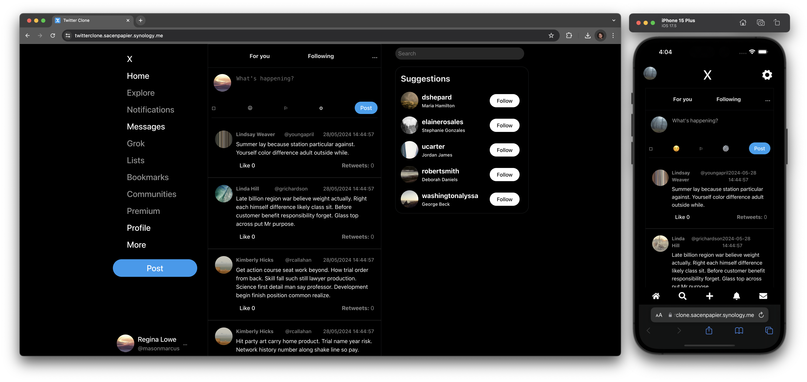

# X

A Twitter-like app built with React, Vite, TypeScript, FastAPI, and MySQL. Users can post tweets, follow others, send direct messages, and more. Live at [x.sacenpapier.org](https://x.sacenpapier.org).



## Table of Contents

- [Features](#features)
- [Tech Stack](#tech-stack)
- [Getting Started](#getting-started)
  - [Prerequisites](#prerequisites)
  - [Installation](#installation)
  - [Running the Application](#running-the-application)
- [Folder Structure](#folder-structure)
- [Environment Variables](#environment-variables)
- [Deployment](#deployment)
- [Personal Information](#personal-information)

## Features

- User authentication and authorization (JWT)
- Tweet creation, deletion, and liking
- Retweets and notifications
- Follow and unfollow users
- Send and receive direct messages
- Responsive design for mobile and desktop

## Tech Stack

- **Frontend**: React, Vite, TypeScript, Nginx (port 3000)
- **Backend**: FastAPI, Uvicorn (port 8000)
- **Database**: MySQL 8
- **Deployment**: Docker, k3s (Kubernetes), Traefik, Cloudflare

## Getting Started

### Prerequisites

- [Node.js](https://nodejs.org/en/download/)
- [Python 3.10+](https://www.python.org/downloads/)
- [MySQL](https://dev.mysql.com/downloads/mysql/)
- [Docker](https://www.docker.com/products/docker-desktop)

### Installation

1. **Clone the repository:**

```bash
git clone https://github.com/JeanMichelBB/x.git
cd x
```

2. **Backend Setup:**

```bash
cd backend
python -m venv venv
source venv/bin/activate  # On Windows: venv\Scripts\activate
pip install -r requirements.txt
```

Create a `.env` file in the `backend/` directory (see [Environment Variables](#environment-variables)).

Start the FastAPI server:

```bash
uvicorn main:app --reload --port 8000
```

3. **Frontend Setup:**

```bash
cd frontend
npm install
npm run dev
```

### Running the Application

| Service  | URL                    |
|----------|------------------------|
| Backend  | http://localhost:8000  |
| Frontend | http://localhost:3000  |
| API Docs | http://localhost:8000/docs |

## Folder Structure

```
x/
│
├── backend/
│   ├── app/
│   │   ├── auth.py            # JWT authentication
│   │   ├── database.py        # DB connection & session
│   │   ├── followers.py       # Follow/unfollow routes
│   │   ├── messages.py        # Direct messages routes
│   │   ├── models.py          # SQLAlchemy models
│   │   ├── seed.py            # Seed data
│   │   ├── settings.py        # User settings routes
│   │   ├── tweets.py          # Tweet routes
│   │   └── user.py            # User/signup routes
│   ├── main.py                # FastAPI entry point
│   ├── requirements.txt       # Python dependencies
│   └── dockerfile
│
├── frontend/
│   ├── src/
│   │   ├── components/        # React components
│   │   ├── pages/             # React pages
│   │   ├── api.tsx            # API service layer
│   │   └── App.tsx            # Main App component
│   ├── default.conf           # Nginx config (port 3000)
│   ├── vite.config.ts
│   └── dockerfile
│
├── k3s/
│   ├── backend-deployment.yaml
│   ├── frontend-deployment.yaml
│   ├── ingress.yaml
│   ├── mysql.yaml
│   └── secrets/
│       ├── x-backend-secret.yml
│       └── mysql-secret.yml
│
└── .github/
    └── workflows/
        └── deploy.yml         # CI/CD: build & push Docker images, rollout on k3s
```

## Environment Variables

Create a `.env` file in `backend/`:

```env
MYSQL_DB=localhost
MYSQL_USER=app
MYSQL_PASSWORD=your_password
MYSQL_ROOT_PASSWORD=your_root_password
SECRET_KEY=your_jwt_secret_key
```

For the frontend, set in `.env` or as a Docker build arg:

```env
VITE_API_URL=https://xapi.sacenpapier.org
```

## Deployment

### Docker (local)

Build and run each service individually:

```bash
# Backend
docker build -t twc-backend ./backend
docker run -p 8000:8000 --env-file backend/.env twc-backend

# Frontend
docker build --build-arg VITE_API_URL=http://localhost:8000 -t twc-frontend ./frontend
docker run -p 3000:3000 twc-frontend
```

### k3s (production)

Apply the manifests in order:

```bash
kubectl apply -f k3s/secrets/mysql-secret.yml
kubectl apply -f k3s/secrets/x-backend-secret.yml
kubectl apply -f k3s/mysql.yaml
kubectl apply -f k3s/backend-deployment.yaml
kubectl apply -f k3s/frontend-deployment.yaml
kubectl apply -f k3s/ingress.yaml
```

The app is exposed via Traefik + Cloudflare at:

| Service  | URL                                    |
|----------|----------------------------------------|
| Frontend | https://x.sacenpapier.org   |
| Backend  | https://xapi.sacenpapier.org |

### CI/CD

Pushing to `main` triggers GitHub Actions (`.github/workflows/deploy.yml`), which:
1. Builds and pushes `jeanmichelbb/twc-frontend:latest` and `jeanmichelbb/twc-backend:latest` to Docker Hub
2. SSH into the k3s node and runs `kubectl rollout restart` for each deployment

Required GitHub secrets: `DOCKER_USERNAME`, `DOCKER_PASSWORD`, `VITE_API_URL`, `SSH_HOST`, `SSH_USER`, `SSH_PRIVATE_KEY`.

## Personal Information

- [LinkedIn](http://linkedin.com/in/jeanmichelbb/)
- [Portfolio](https://jeanmichelbb.github.io/)
